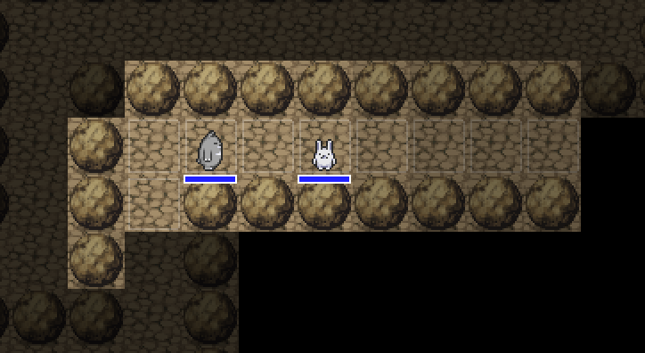

= 7DRL 2020 devlog

I'm going to do my challenge during March 2nd to 8th using C# and https://github.com/prime31/Nez[Nez].

== Before the challenge

It's first time for me to program a game, and I've been working on it around two years. But I'm pretty sure that I already got over the most difficult part of the implementation: a turn-based game system. So now I can walk around the dungeon generated by the https://github.com/odedw/karcero[Karcero] dungeon generator:

Cute XD. So, in this challenge, I have to focus on the game content it self, and I've been thinking about it. Unfortunatelly, however, I'm not sure what I really want to pl
y; now I have to be a better creater.
